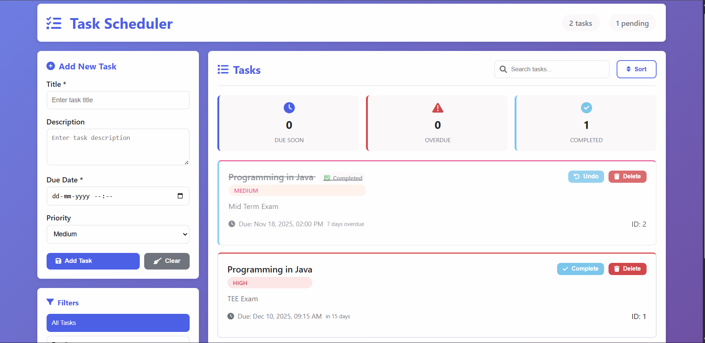

# Task Scheduler - Full Stack Application

## Overview
The Task Scheduler is a comprehensive full-stack web application designed to help users efficiently manage their tasks, deadlines, and priorities. Built using Java for the robust backend and modern web technologies for the frontend, this application provides an intuitive interface for personal task management. It features a custom RESTful API built with SparkJava framework, ensuring efficient handling of HTTP requests and seamless data persistence.

## Features
- **Task Management**: Complete CRUD operations for tasks with real-time updates
- **Smart Deadline Tracking**: Automatic detection of overdue and due-soon tasks
- **Priority System**: Organize tasks by High, Medium, and Low priority levels
- **Advanced Filtering**: Filter tasks by status (All, Pending, Completed, Overdue, Due Soon)
- **Real-time Search**: Instant search functionality across task titles and descriptions
- **Data Persistence**: JSON-based storage ensuring tasks persist between sessions
- **Responsive Design**: Mobile-friendly interface that works across all devices
- **Statistics Dashboard**: Visual overview of task completion metrics and progress tracking

## Technologies/Tools Used
- **Backend**: Java 11, SparkJava Web Framework, Jackson JSON Processor
- **Frontend**: HTML5, CSS3 with Flexbox/Grid, Vanilla JavaScript
- **Build Tool**: Maven for dependency management
- **Development**: VS Code with Java Extension Pack
- **Version Control**: Git & GitHub

## Steps to Install & Run the Project

### Prerequisites
- Java Development Kit (JDK 11 or later) installed
- Maven installed (optional, VS Code can handle dependencies)

### Installation

1. **Clone or Download the Project**:
   - Download the project files to your local machine
   - Extract to your preferred directory

2. **Open in VS Code**:
   ```bash
   cd TaskScheduler
   code .

## Run the Application

### Method (VS Code): 
1. Press `F5` or go to **Run → Start Debugging** 
2. Select **"Launch Task Scheduler"**

## Access the Application

Open your web browser and navigate to: **`http://localhost:8080`**
The API endpoints are available at: **`http://localhost:8080/api/`**

## Instructions for Testing

### Task Creation Test
- Fill out the **"Add New Task"** form with title, description, due date, and priority
- Click **"Add Task"**
- **Expected Result**: Task appears in the task list with correct details

### Filtering Test
- Create multiple tasks with different statuses
- Use filter buttons (**All, Pending, Completed, Overdue, Due Soon**)
- **Expected Result**: Only tasks matching the selected filter are displayed

### Search Test
- Type in the search box with existing task titles or descriptions
- **Expected Result**: Matching tasks are filtered in real-time

### Deadline Detection Test
- Create a task with a past due date
- **Expected Result**: Task automatically shows as **"Overdue"**
- Create a task due within 24 hours
- **Expected Result**: Task automatically shows as **"Due Soon"**

## Screenshot


*Figure 1: Task Scheduler Interface*